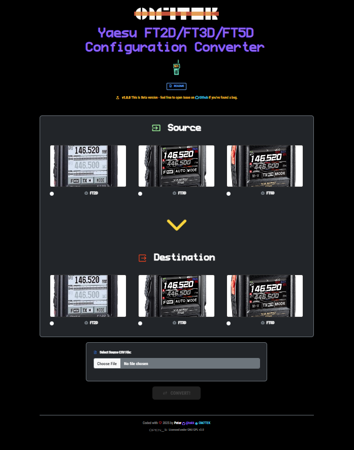

# 📻 Yaesu FT2D/FT3D/FT5D Configuration Converter

[](https://www.gnu.org/licenses/gpl-3.0)
[](https://github.com/tekk)
[](https://www.om7tek.com)


[](https://www.yaesu.com/)

[](https://www.om7tek.com/)


A powerful **web-based CSV configuration converter** for Yaesu digital transceivers. Seamlessly convert memory channel configurations between **FT2D**, **FT3D**, and **FT5D** amateur radio transceivers.

## 🎯 Overview

As an active amateur radio operator (**OM7TEK**), I created this tool to solve a common problem in the ham radio community: **incompatible CSV memory channel formats** between different Yaesu transceiver models. Whether you're upgrading from an **FT2D to FT3D**, migrating to the newer **FT5D**, or helping fellow hams with their configurations, this converter handles the technical complexities automatically.

### 🔧 Key Features

- **🔄 Bidirectional Conversion**: Convert between any combination of FT2D ↔ FT3D ↔ FT5D
- **🎯 Precise Field Mapping**: All 48-53 CSV fields are properly mapped and converted
- **🧠 Intelligent Format Detection**: Automatically detects source CSV format
- **⚡ Real-time Processing**: Instant conversion with detailed logging
- **🌐 Web-based Interface**: No software installation required
- **📱 Responsive Design**: Works on desktop, tablet, and mobile devices
- **🔒 Privacy First**: All processing happens locally in your browser
- **🎨 Modern UI**: Beautiful, intuitive interface with visual conversion flow

## 🚀 Quick Start

### Online Version
Visit the live converter:
- [**Github Pages** latest version](https://tekk.github.io/yaesu_ft2d_ft3d_ft5d_config_converter/)
- [OM7TEK **yaesu.om7tek.com** mirror](https://yaesu.om7tek.com/)

## 🖼️ Preview



## 📋 Usage Instructions

### Step 1: Select Source Transceiver
Choose your **source transceiver model** (the format you're converting FROM):
- **FT2D**: Yaesu FT2D/FT2DE dual band digital transceiver _([📊 sample CSV](sample_csv/FT2D.csv))_
- **FT3D**: Yaesu FT3D/FT3DE tri-band digital transceiver _([📊 sample CSV](sample_csv/FT3D.csv))_
- **FT5D**: Yaesu FT5D/FT5D E tri-band digital transceiver _([📊 sample CSV](sample_csv/FT5D.csv))_

### Step 2: Select Destination Transceiver
Choose your **destination transceiver model** (the format you're converting TO):
- The interface prevents selecting the same model for source and destination
- Visual indicators show the conversion direction with a large yellow arrow

### Step 3: Upload CSV File
- **Drag & drop** your CSV file onto the upload area, or
- **Click** to browse and select your memory channel CSV export
- Supported file types: `.csv` files exported from Yaesu programming software

### Step 4: Convert & Download
- Click the **"CONVERT!"** button to process your file
- The converted CSV will be automatically downloaded
- Import the new file into your destination transceiver's programming software
- Profit!

## 🔧 Technical Specifications

### Supported Models & Formats

| Model | CSV Fields | Digital Modes | Memory Channels | Notes |
|-------|------------|---------------|-----------------|-------|
| **FT2D** | 48 fields | C4FM, FM, AM | 900 | Original dual-band format |
| **FT3D** | 53 fields | C4FM, FM, AM, DN, AMS | 900 | Enhanced tri-band format |
| **FT5D** | 53 fields | C4FM, FM, AM, DN, AMS | 900 | Latest tri-band format |

### Field Mapping Details

#### The converter handles **precise mapping** of all critical fields:

- **🔢 Channel Numbers**: Preserved across all formats
- **📡 Frequencies**: RX/TX frequencies with proper validation
- **🎵 CTCSS/DCS**: Tone and DCS code conversion
- **⚡ Power Levels**: HIGH/LOW1/LOW2/LOW3 mapping
- **📶 Step Sizes**: 5.0KHz to 100KHz frequency steps
- **🎯 Band Flags**: VHF/UHF automatic detection
- **📝 Alpha Tags**: Memory channel names preserved
- **🔧 Mode Settings**: NFM/NAM (FT2D) ↔ FM/AM (FT3D/FT5D)

### Browser Compatibility

- ✅ **Chrome** 90+ (Recommended)
- ✅ **Firefox** 88+
- ✅ **Safari** 14+
- ✅ **Edge** 90+
- ⚠️ **Internet Explorer**: Not supported, and never will be

## 🛠️ Development

### Architecture
- **Frontend**: Pure HTML5, CSS3, JavaScript (ES6+)
- **Framework**: Bootstrap 5.3.0 for responsive UI
- **Fonts**: Custom Nerd Fonts and Material Symbols for icons
- **Processing**: Client-side CSV parsing and conversion

### File Structure
```
yaesu-config-converter/
├── index.html              # Main application
├── css/
│   ├── bootstrap.min.css   # Bootstrap framework
│   └── style.css          # Custom styles
├── js/
│   ├── bootstrap.bundle.min.js # Bootstrap JavaScript
│   └── app.js             # Main application logic
├── fonts/                 # Custom font files
├── sample_csv/           # Example CSV files
└── img/                  # Transceiver images
```

## 🎯 SEO Keywords

**Amateur Radio**: Yaesu FT2D, Yaesu FT3D, Yaesu FT5D, ham radio, amateur radio programming, memory channel converter, CSV converter, digital transceiver, C4FM, System Fusion, WIRES-X, dual band, tri-band

**Technical**: CSV file converter, memory channel programming, frequency management, amateur radio software, transceiver configuration, radio programming software, ham radio tools

## 🤝 Contributing

Fellow hams, you are welcome to contribute! This project benefits the entire **amateur radio community**.

### How to Contribute:
1. **🐛 Report Bugs**: [Open an issue](https://github.com/tekk/yaesu_ft2d_ft3d_ft5d_config_converter/issues) with details
2. **💡 Feature Requests**: Suggest improvements for other Yaesu models
3. **🔧 Code Contributions**: Submit pull requests with enhancements
4. **📖 Documentation**: Help improve instructions and examples

### Planned Features:
- 📻 **Additional Models**: FT70D, FT25/FT65 series support
- 📊 **Validation**: Enhanced CSV validation and error reporting
- 💾 **Backup**: Configuration backup and restore functionality
- 🌍 **Localization**: Multi-language support for international hams

## 📞 Support & Contact

**OM7TEK - Peter Javorsky**
- 🌐 **Website**: [om7tek.com](https://www.om7tek.com)
- 👤 **Portfolio**: [tekk.eu](https://tekk.eu)
- 💻 **GitHub**: [@tekk](https://github.com/tekk) 
- 📧 **Email**: tekk.sk@gmail.com
- 📻 **QRZ**: [OM7TEK](https://www.qrz.com/db/OM7TEK)

## 📜 License

This project is licensed under the **GNU General Public License v3.0**.

```
Copyright (c) 2025 Ing. Peter Javorsky (OM7TEK)

This program is free software: you can redistribute it and/or modify
it under the terms of the GNU General Public License as published by
the Free Software Foundation, either version 3 of the License, or
(at your option) any later version.
```

See [LICENSE](LICENSE) file for complete terms.

## ⚡ Disclaimer

This software is provided **"AS IS"** without warranty. Always **backup your original configurations** before conversion. Test converted files in programming software before uploading to your transceiver.

**73!** 📻  
**OM7TEK**

---

### 🏷️ Tags
`#YaesuFT2D` `#YaesuFT3D` `#YaesuFT5D` `#AmateurRadio` `#HamRadio` `#C4FM` `#SystemFusion` `#CSV` `#MemoryChannels` `#OM7TEK`
